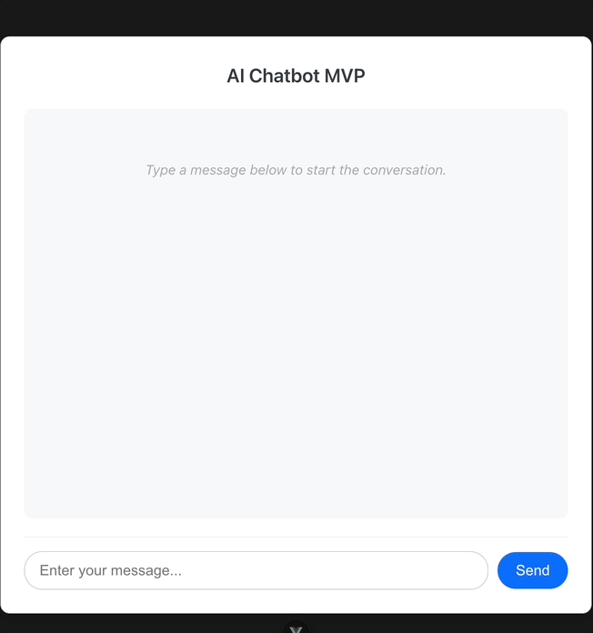

# AI Chatbot MVP (Vue + Flask + Gemini)

## Overview

This is a Minimum Viable Product (MVP) of a web-based chatbot application built as a portfolio project. It demonstrates practical integration between a modern frontend (**Vue.js 3** with Vite) and a Python/Flask backend powered by the **Google Gemini** Generative AI API (`gemini-1.5-flash-latest`).

The chatbot is designed to handle various user intents within a simulated e-commerce support context, including:
* Answering Frequently Asked Questions (FAQs) based on exact matches.
* Providing product information using a basic **Retrieval-Augmented Generation (RAG)** approach.
* Checking order status using **Function Calling** (interacting with dummy data).
* Engaging in general conversation for unhandled intents.

## Demo (Optional)

A quick demonstration of the chatbot in action:



## Features

* **Conversational Interface:** Simple chat UI built with **Vue.js**, displaying conversation history with alternating user/AI messages. Includes basic loading and error indicators with distinct styling.
* **Intent Detection:** Backend logic (`detect_intent` function) classifies user input into predefined categories (FAQ, Product Info, Order Status, General Chat) using keywords and simple patterns.
* **FAQ Handling:** Provides predefined answers for exact-match FAQ queries stored in the backend (`data_store.py`).
* **Product Information (Basic RAG):**
    * Retrieves relevant product details from an external JSON file (`products.json`) based on keywords/name (`retrieve_product_info` function).
    * Augments a prompt with the retrieved context.
    * Uses the **Gemini API** to generate a natural language description based *only* on the provided context, improving factual grounding and reducing hallucination.
* **Order Status Check (Function Calling):**
    * Defines a function schema (`get_order_info`) for the **Gemini API**.
    * When order status intent is detected, sends the query and function schema (`tools`) to Gemini.
    * If Gemini requests the `get_order_info` function call, the backend extracts the `order_id` argument identified by the AI.
    * Executes the *local* `get_order_info` function (querying dummy order data in `data_store.py`).
    * Sends the function execution result back to the Gemini API via conversation history.
    * Gemini generates the final natural language response based on the retrieved order status. Demonstrates giving the LLM agency to use external "tools".
* **General Conversation:** Falls back to the standard **Gemini API** generation (with English response instruction) for queries that don't match other intents.

## Tech Stack

* **Frontend:** **Vue.js (v3)**, Vite, Axios, CSS
* **Backend:** **Python (v3.11+)**, **Flask**, **`google-generativeai` (v0.8.5 used)**, `python-dotenv`, `Flask-CORS`
* **AI Model:** **Google Gemini API (`gemini-1.5-flash-latest` model)**
* **Data Storage:** JSON (`products.json`), Python Dict/List (FAQ/Orders in `data_store.py` - Dummy Data)
* **Development:** Git, GitHub, Virtual Environment (`.venv`), pip, npm, VS Code

## Key Implementations & Learnings

This project served as valuable practice in integrating a powerful LLM into a full-stack application and implementing modern AI interaction patterns.

### Basic RAG for Product Information

A simple **RAG** pipeline was implemented to provide grounded answers about products:
1.  Product data was externalized to `products.json`.
2.  A keyword/name matching function (`retrieve_product_info`) acts as the retriever, fetching relevant text snippets.
3.  The prompt sent to Gemini is dynamically augmented with this retrieved context, instructing the model to answer **based solely on the provided information**. This helps reduce hallucination and ensures answers are based on the available "knowledge base".
4.  Prompts were engineered to instruct the AI to respond in English and adopt a helpful persona.

### Function Calling for Order Status

Basic **Function Calling** allows the AI to utilize "tools":
1.  An OpenAPI-like schema was defined (as a Python dictionary) for the `get_order_info` function, describing its purpose and parameters to the AI.
2.  This schema is passed to the Gemini API via the `tools` parameter when an order status intent is detected.
3.  The backend handles the **multi-turn conversation** flow required by Function Calling:
    * Gemini's initial response may contain a `function_call` request.
    * The backend parses this, executes the corresponding local function (`get_order_info`).
    * The function's result is packaged into a `function_response` format within the conversation history.
    * This history (including the result) is sent back to Gemini for final response generation.
4.  This demonstrates how LLMs can be given agency to interact with external data sources or perform actions based on conversation context.

### Challenges & Learnings

* Setting up and troubleshooting cross-platform development environments (Python venv, Node.js dependencies, PATH issues, Execution Policies).
* Debugging CORS errors between frontend and backend servers on different ports.
* Resolving Python errors (`NameError`, `IndentationError`, `ImportError`, `TypeError`) and understanding tracebacks.
* Implementing and refining basic keyword/pattern-based intent detection logic.
* Refactoring backend code for better structure and maintainability by separating data access (`data_store.py`).
* Understanding and debugging the precise schema structures and interaction flows required for the `google-generativeai` library's Function Calling feature (especially handling schema definitions and conversation history correctly across different library versions/expectations).
* Iterative prompt engineering to improve AI response quality and ensure adherence to instructions (e.g., responding in English, using only provided context).
* Utilizing Git for version control throughout the development process.

## Setup and Usage (Local)

1.  **Clone the repository:**
    ```bash
    git clone [https://github.com/yskmtb0714/chatbot-mvp.git](https://github.com/yskmtb0714/chatbot-mvp.git)
    cd chatbot-mvp
    ```
2.  **Backend Setup:**
    * Navigate to the backend directory: `cd backend`
    * Create a Python virtual environment: `python -m venv .venv`
    * Activate the virtual environment:
        * Windows (PowerShell): `.\.venv\Scripts\Activate.ps1`
        * macOS/Linux (zsh/bash): `source .venv/bin/activate`
    * **Create `requirements.txt` (if not present):** If you installed packages manually before, generate the requirements file now:
        ```bash
        pip freeze > requirements.txt
        ```
    * **Install dependencies:**
        ```bash
        pip install -r requirements.txt
        ```
    * Create a `.env` file in the `backend` directory.
    * Add your Google Gemini API key to the `.env` file (replace `YOUR_API_KEY_HERE`):
        ```dotenv
        GEMINI_API_KEY='YOUR_API_KEY_HERE'
        ```
3.  **Frontend Setup:**
    * Navigate to the frontend directory: `cd ../frontend` (from backend) or `cd frontend` (from root)
    * Install dependencies:
        ```bash
        npm install
        ```
4.  **Run the Application:**
    * Open **two separate terminals**.
    * **Terminal 1 (Backend):** Navigate to `backend`, activate venv (`source .venv/bin/activate` or `.\.venv\Scripts\Activate.ps1`), run:
        ```bash
        python app.py
        ```
    * **Terminal 2 (Frontend):** Navigate to `frontend`, run:
        ```bash
        npm run dev
        ```
5.  **Access:**
    * Open the `Local:` URL provided by the frontend server (e.g., `http://localhost:5173/`) in your web browser.

## Future Work (Optional)

* Enhance RAG with **vector search** (using embeddings and a vector database like ChromaDB or FAISS) for more semantic product/FAQ retrieval.
* Implement actual **database connections** (e.g., SQLite, PostgreSQL) instead of dummy data/JSON.
* Expand **Function Calling** capabilities (e.g., allow searching products via function call).
* Improve **frontend UI/UX** further (message streaming, advanced styling, clear chat button).
* Add user authentication.
* **Deploy** the application to a cloud platform (e.g., Google Cloud Run, Vercel, Netlify).